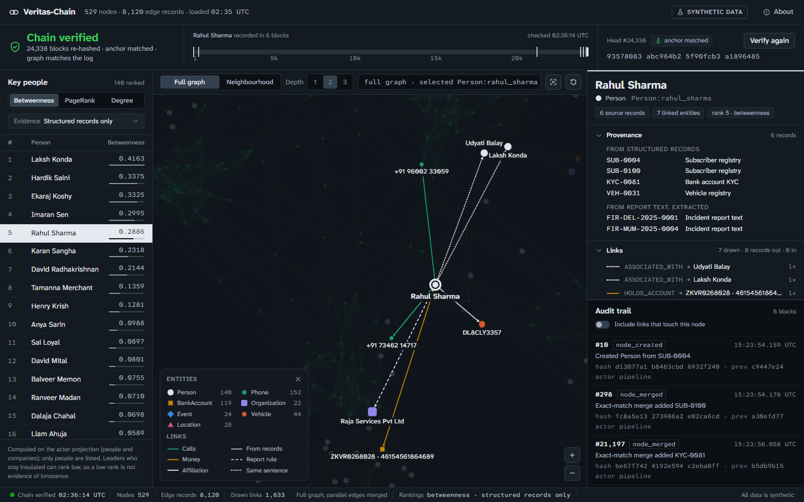

# Veritas-Chain

**Criminal network analysis on synthetic data.** A solo portfolio project based on problem statement
SIH26189 ("AI-Powered Criminal Network Analysis System", Ministry of Home Affairs). It builds a
link-analysis graph from call records, bank transactions and free-text incident reports, ranks key
individuals, detects clusters, flags anomalies, and records every graph change in a tamper-evident
hash chain — with a read-only web UI to explore it all.

> **All data is synthetic.** Every name, phone number, account, vehicle and report is generated.
> Nothing here is, or claims to be, real law-enforcement data.



## Contents

- [What it does](#what-it-does)
- [Status](#status)
- [Architecture](#architecture)
- [Quickstart](#quickstart)
- [Repo layout](#repo-layout)
- [Design decisions](#design-decisions)
- [Results at a glance](#results-at-a-glance)
- [Known limitations](#known-limitations)
- [Future work](#future-work)
- [What would change in production](#what-would-change-in-production)
- [Further reading](#further-reading)

## What it does

1. **Generates** a deterministic synthetic dataset — subscriber/CDR/bank/vehicle registries plus
   free-text FIRs — with planted criminal clusters, bridges, laundering rounds, decoys and a name
   collision, all checked against a machine-readable ground truth.
2. **Extracts** entities (spaCy NER + regex) and relations (pattern rules over sentence structure)
   from the report text.
3. **Builds** one validated NetworkX graph from structured records and extracted text, through a
   single write path with exact-match entity resolution.
4. **Analyzes** the actor graph: centrality (degree, betweenness, PageRank), Louvain communities,
   and rule-based anomalies (call spikes, circular money flows) — validated against expectations
   fixed before each run.
5. **Audits** every graph write in a SHA-256 hash chain (SQLite), with `verify_chain`, replay, and
   a tamper demo showing exactly what is and isn't detectable.
6. **Serves** it all read-only through FastAPI, with a Cytoscape.js graph explorer, rankings panel
   and audit trail.

## Status

| Phase | Scope | Status |
|---|---|---|
| 0 | Data schema + models | **Done, signed off** |
| 1 | Synthetic data generator + ground truth | **Done, signed off** |
| 2 | Entity extraction (spaCy NER + regex) | **Done, signed off** |
| 3 | Relation extraction + graph construction + exact-match entity resolution | **Done, signed off** |
| 4 | Centrality, Louvain communities, rule-based anomalies | **Done, signed off** (1 expectation not met, 2 met weakly; follow-up revisions on seed 11: R3 met, R1 and R2 not met) |
| 5 | SHA-256 hash-chain audit log (SQLite) + tamper demo | **Done, signed off** |
| 6 | FastAPI + Cytoscape.js frontend | **Done, signed off** |

## Architecture

```
data/ (synthetic CSVs + report text)
   │
   ├── structured rows ─────────────────────────────┐
   └── report text → Phase 2 extraction → mentions ─┤
                                                    ▼
                          Phase 3: NetworkX MultiDiGraph  ──► Phase 5: hash-chain audit log (SQLite)
                                                    │
                          Phase 4: analytics (centrality, communities, anomaly rules)
                                                    │
                          Phase 6: FastAPI  ──►  Cytoscape.js UI
```

## Quickstart

```bash
pip install -r requirements.txt
python -m veritas.synth --seed 42 --out data   # regenerate the synthetic dataset (deterministic)
python -m veritas.extract --evaluate           # extract entities from FIRs, score against ground truth
python -m veritas.extract.relation_eval        # score relation rules (gold entities, end to end, challenge set)
python -m veritas.graph --evaluate             # build the graph (GraphML) + its audit log, entity-resolution report, graph evaluation
python -m veritas.analytics --evaluate         # centrality, communities, anomaly rules, validation vs ground truth
python -m veritas.audit                        # verify the audit chain against its anchor; replay it against the saved graph
python -m veritas.audit.tamper_demo            # tamper with copies of the audit log and show what verify_chain catches
python -m veritas.api                          # serve the API and the graph explorer at http://127.0.0.1:8000
python -m pytest                               # all tests
```

## Repo layout

| Path | What |
|---|---|
| [`schema.md`](schema.md) | Node types, edge types, ID and confidence rules, entity-resolution limits |
| [`veritas/models.py`](veritas/models.py) | Pydantic models that enforce the schema |
| [`veritas/normalize.py`](veritas/normalize.py) | Canonical-key functions; these are the entity-resolution rules |
| [`veritas/config.py`](veritas/config.py) | Settings (confidence defaults, analytics thresholds, API file paths), each overridable with env vars |
| [`veritas/synth/`](veritas/synth/) | Synthetic data generator: population, incident scenarios, calls and money, FIR text |
| [`data/`](data/) | Generated dataset (seed 42) and `ground_truth.json`. See [`data/README.md`](data/README.md). |
| [`veritas/extract/`](veritas/extract/) | FIR parsing, regex extractors, spaCy NER, relation rules (`relations.py`), evaluation |
| [`output/phase2/`](output/phase2/) | Extracted entities and evaluation reports for both spaCy models |
| [`veritas/graph/`](veritas/graph/) | Graph builder (single validated write path), CSV and text loaders, GraphML I/O, reports |
| [`output/phase3/`](output/phase3/) | Build report, relation and graph evaluations, evidence sentence for every text edge. `graph.graphml` is rebuilt, not committed. |
| [`veritas/analytics/`](veritas/analytics/) | Actor-graph projection, centrality, Louvain, spike and money-cycle rules, validation with fixed expectations |
| [`output/phase4/`](output/phase4/) | Rankings, communities, anomalies (`analytics.json`) and validation (`evaluation.json`) |
| [`veritas/audit/`](veritas/audit/) | Hash chain (`chain.py`), replay of the log into a graph (`replay.py`), verify CLI, tamper demo |
| [`output/phase5/`](output/phase5/) | `audit_report.json` (verification and replay check) and `tamper_demo.json`. `audit.sqlite` and `anchor.json` are rebuilt, not committed. |
| [`veritas/api/`](veritas/api/) | FastAPI app (`app.py`) and the page (`static/`: HTML, CSS, JS, vendored Cytoscape.js 3.34.3 with its MIT licence) |
| [`docs/`](docs/) | Full methodology, portfolio summary, and Phase 6 screenshots |
| [`tests/`](tests/) | Tests for the schema, generator, extraction, relations, graph, analytics, audit log and API. `tests/fixtures/relation_challenge.json` is the hand-written relation probe. |

## Design decisions

- **NetworkX instead of Neo4j.** At this size (529 nodes, 8,120 edges), an in-process graph means no database to run and algorithms can be called directly.
- **Pydantic models with a closed type set.** Invalid endpoints, naive timestamps, unknown fields and out-of-range confidence all fail validation.
- **Phones and accounts are their own nodes.** A call record links numbers, not people; the link from a person to a phone or account is a separate edge with its own source.
- **IDs are derived from content.** Node ID = type + normalized key, so exact-match entity resolution is just ID equality. Edge ID = a hash of the edge's content, so loading the same record twice is harmless.
- **Confidence is an ordinal weight, not a probability.** Set per method/label from measured precision, deliberately kept conservative.
- **False splits are preferred over false merges.** A wrong merge invents links between strangers and distorts centrality.

Full rationale, per-phase validation protocols (written before each run) and the revisions tested on a held-out seed: [docs/methodology.md](docs/methodology.md).

## Results at a glance

| Area | Headline result |
|---|---|
| Graph (seed 42) | 529 nodes, 8,120 edges (8,015 structured, 105 from text) |
| Entity extraction | Person F1 90.3, Location F1 76.7, Organization F1 46.6, Phone/Vehicle regex 100 (seed 42, `en_core_web_md`) |
| Relation extraction | 90.4 F1 with gold entities, 76.9 F1 end to end; 21.4 F1 on an unseen-phrasing challenge set |
| Centrality/anomalies (Phase 4) | Bridges found (top 10% betweenness); both laundering rounds flagged exactly; decoy loop correctly rejected; spike rule flags 4 of 6 planted spikes; Louvain finds cities, not gangs (purity 19–33%) |
| Audit chain (Phase 5) | 24,338 blocks; untampered chain verifies; replay reproduces the graph exactly; every tamper scenario caught except a full rewrite without an external anchor (by design, and shown) |
| API + UI (Phase 6) | All API responses match their source of truth (graph, rankings, audit log) exactly; verified in a real browser with Playwright; no `innerHTML` anywhere in the frontend |

Full numbers, tables and per-phase validation results: [docs/methodology.md](docs/methodology.md).

## Known limitations

- **Entity resolution is exact match only** — common names can falsely merge; aliases and transliterations falsely split (`schema.md` section 7).
- **Relation rules are brittle outside the FIR template phrasing** — 12.5% recall on a hand-written challenge set of different phrasing.
- **Community detection finds geography, not criminal groups** — Louvain purity is 19–33% at default resolution; a nested-Louvain revision was tried and failed on a held-out seed.
- **The call-spike rule misses roughly a third to two thirds of planted spikes**, depending on seed; thresholds are unvalidated analyst choices.
- **The audit chain detects tampering but can't prevent it** — a full rewrite of every hash from a tampered block onward passes internal checks; only an external anchor catches it, and this demo's anchor sits next to the database.
- **No authentication anywhere** — the API binds to localhost only, `actor` in the audit log is an unauthenticated free-text string.
- **Synthetic data is cleaner than reality** — 15 FIR templates, no typos/aliases, so extraction accuracy here is an upper bound, not a generalisation estimate.

Full list (25+ items, one per component): [docs/methodology.md](docs/methodology.md#known-limitations-full-list).

## Future work

- Correcting NER type errors (e.g. ORG-tagged people) against the subscriber/KYC/vehicle registries.
- Combining the two call-spike rule scopes — promising on seen seeds, but not validated on an unseen one.
- Relation extraction that generalises beyond template phrasing (dependency parsing or a trained classifier), with negation handling.

Details and caveats: [docs/methodology.md](docs/methodology.md#future-work-not-implemented).

## What would change in production

| This project | Production |
|---|---|
| NetworkX in memory | Neo4j (or another graph DB) with indexed lookups and a query language |
| Exact-match entity resolution | Probabilistic record linkage (for example Splink or Dedupe) with human review of merges |
| Fixed confidence per method | Confidence calibrated on labelled data, per source and per extractor |
| SHA-256 hash chain in SQLite | Append-only storage the application can't rewrite, for example a database role with INSERT-only rights or a managed ledger table |
| Anchor file next to the database | Head hash published periodically to a separate system: an RFC 3161 timestamping authority, a transparency log, or write-once (WORM) storage |
| Anyone who can recompute SHA-256 can forge a rewrite | Blocks signed or HMAC'd with a key held in an HSM or KMS, so rewriting the chain also needs the key |
| `actor` is a free-text string | An authenticated user or service identity on every write |
| Local API with no authentication | Authenticated users with role-based access, and an audit trail of who viewed which person or case |
| The whole graph sent to the browser | Case-scoped server-side queries (for example Cypher on Neo4j) with paging and filters |
| Verify replays the entire log on each click | Scheduled, incremental verification from the last verified anchor, with alerts |
| Single writer; a second writer fails on the index key | One serialized writer service, or a database transaction that reads the head and inserts in one step |
| Rule-based anomaly detection | Rules plus statistical or ML models tuned against labelled cases |

## Further reading

- [docs/methodology.md](docs/methodology.md) — full phase-by-phase design decisions, validation protocols and results
- [docs/portfolio-summary.md](docs/portfolio-summary.md) — how this was built with Claude Code, and the mistakes caught along the way
- [schema.md](schema.md) — node/edge types, ID rules, confidence rules, entity-resolution limits
- [data/README.md](data/README.md) — what the synthetic dataset contains and how to regenerate it
